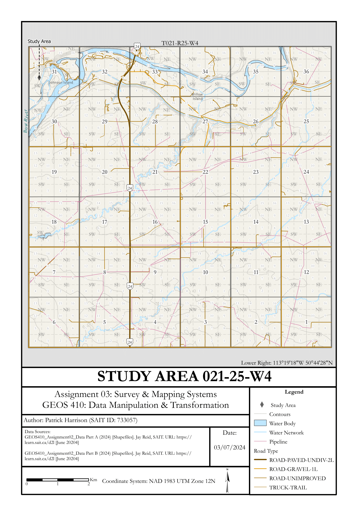
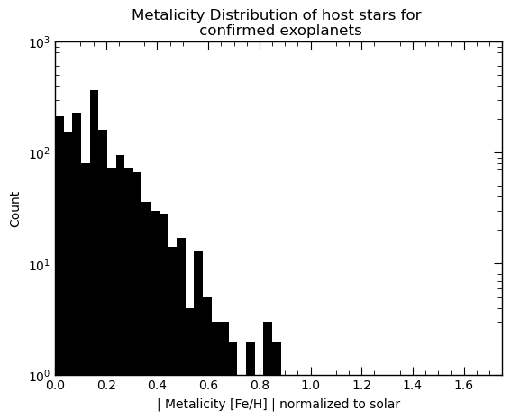
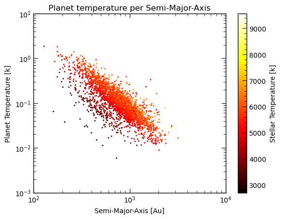

Title: Portfolio
Category: Portfolio
Date: 2023-10-31
Modified: 2023-07-31


## [Study Area Map](../pdfs/StudyAreaMap.pdf)

### Summary
The purpose of this project is to expand my cartography skills by creating a study area map in Alberta showing
the study sites, ATS gird, and relevant base features.
A final layout was created after transforming the data from NTS grid sources and merging and cleaning the courses
to convey the important information.

### Tech Stack
- ESRI ArcGIS Pro
- ESRI Geoprocessing Tools

### Process
Data was provided for all NTS grids in Alberta. Data was then merged and clipped to the correct township the study area was in,
cleaned and exported to an ESRI Geodatabase and properly symbolized and added to a map layout.

### Results

Full Layout can be downloaded [here](../pdfs/StudyAreaMap.pdf)



### Key Takeaways
This project expanded my skills in data management and cartography. 


---


## [Kepler Data Exploratory Analysis](https://github.com/PatHarrison/KeplarDataAnalysis)
### Summary
The Purpose of this project was to find patterns in observer exoplanets and thier host stars.
An Exploratory Analysis was done using Python scripting, relational database management systems (MySQL) and IPython Notebooks.
Date was pulled from the NASA kepler database, transformed into a locally hosted MySQL server and analyzed using Python in a 
Jupyter Notebook environment. 

### Tech Stack
- Python
- MySQL
- Matplotlib
- Pandas
- Jupyter Notebooks (Jupyter Lab)

### Process
Data was loaded into a MySQL database with the following schema:
```SQL
CREATE TABLE IF NOT EXISTS Stellar_Objects(
	kepid INT PRIMARY KEY NOT NULL,
	koi_steff FLOAT,
	koi_slogg FLOAT,
    koi_smet FLOAT,
    koi_srad FLOAT,
    koi_smass FLOAT,
    koi_srho FLOAT,
    koi_count INT
);
CREATE TABLE IF NOT EXISTS Transit_Properties(
	kepoi_name CHAR(9) PRIMARY KEY NOT NULL,
	kepid INT,
		FOREIGN KEY (kepid) REFERENCES Stellar_Objects(kepid),
	koi_period FLOAT,
    koi_prad FLOAT,
    koi_sma FLOAT,
    koi_teq FLOAT,
	koi_ror FLOAT,
    koi_dor FLOAT
);
CREATE TABLE IF NOT EXISTS koi_disposition(
	kepoi_name CHAR(9) PRIMARY KEY NOT NULL,
	kepid INT,
		FOREIGN KEY (kepid) REFERENCES Stellar_Objects(kepid),
    koi_disposition SET('CONFIRMED', 'CANDIDATE', 'FALSE POSITIVE'),
    koi_score FLOAT
);
```
Data was then queried through the Python API for MySQL.

### Results

The full results of this project are available on [Github](https://github.com/PatHarrison/KeplarDataAnalysis)
A couple visual sample results can be seen below.

#### Number of transit objects per the metilicity of the host star


The plot above shows the distribution of the frequency of confirmed exoplanets orbiting host stars with increasing metalicity.
In an astrophysical context, the metalicity in a star is the ratio of the concentration of H and He with everything heavier.
Usually this is approximated by Iron (Fe) as it is the last element that can be fused within the normal fusion cycles in the star.
The SQL query for the data is:
```SQL
SELECT ABS(so.koi_smet)
FROM Stellar_Objects AS so
WHERE so.kepid IN (SELECT kepid FROM koi_disposition
                    WHERE koi_disposition="CONFIRMED")
```

#### Relationship Between the temperature of the star, temperature of the planet and the Semi-Major axis of it's orbit.


This relationship is not very surprising but it shows correlation between planet and stellar temperatures and how that is affected by the object's orbits.
The SQL query for this data is:
```SQL
SELECT koi_teq, koi_sma, koi_steff
FROM Transit_Properties AS tp
LEFT JOIN Stellar_Objects AS so
ON tp.kepid=so.kepid
WHERE tp.kepid IN (SELECT kepid FROM koi_disposition WHERE koi_disposition="CONFIRMED")
```

### Key Takeaways
This project showcases my database design, data visualization, and python scripting skill set.
Although this project was astrophysical in nature, the tools used and skills learned are applicable in almost any field.
